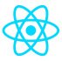

# Sobre

Olá, meu nome é **Hermerson** sou fascinado por programação desde 2016. Desde o início eu sempre busquei aprender um pouco de cada coisa e por isso me considero um desenvolvedor generalista. Hoje os projetos que eu desenvolvo são mais voltados para a Web e a maioria deles estão aqui no Github.

## Linguagens/Frameworks e Tecnologias

> Algumas linguagens/frameworks e tecnologias com que eu programo.

## Aprendendo

> O que eu estou aprendendo nesse momento.

